# GDD - Game Design Document - Módulo 1 - Inteli

## Academy da Academy

#### Integrantes:

#### Davi de Oliveira Ferreira<br>Eduardo Fidelis Chaves<br>Lucas Periquito Costa<br>Marcelo Rubim Rossignolli<br>Matheus Fernandes Guimarães de Sousa<br>Pablo de Azevedo<br>Rodrigo Lee

## Sumário

[1. Introdução](#c1)

[2. Visão Geral do Jogo](#c2)

[3. Game Design](#c3)

[4. Desenvolvimento do jogo](#c4)

[5. Casos de Teste](#c5)

[6. Conclusões e trabalhos futuros](#c6)

[7. Referências](#c7)

[Anexos](#c8)

<br>

# <a name="c1"></a>1. Introdução (sprints 1 e 4)

## 1.1. Escopo do Projeto

### 1.1.1. Contexto da indústria (sprints 1 e 4)

&nbsp;&nbsp;&nbsp;&nbsp;A Oracle Academy é uma ramificação filantrópica da empresa Oracle, cuja missão é ajudar os professores de tecnologia do mundo inteiro a prepararem seus alunos para carreiras desse meio de forma gratuita e acessível. A indústria de tecnologia educacional tem experimentado um crescimento exponencial desde 2010 no Brasil, acumulando mais de meio bilhão de dólares em investimento em startups, o que resulta em uma abundante quantidade de empresas Big Tech e de pequeno porte compromissados em integrar a tecnologia no ambiente de aprendizagem, em uma plataforma própria, para ensinar em sua maioria, tecnologia, computação, design e business.

### 1.1.2. Análise SWOT (sprints 1 e 4)

- **Forças:** Experiência de vários anos no mercado; Afiliação com a Oracle; Ensino aprofundado nos assuntos retratados; Suporte aos professores através de workshops;
- **Fraquezas:** Processo de cadastro complexo na plataforma; Conteúdo nichado em tecnologias Oracle/Pouca diversidade de tópicos;
- **Oportunidades:** Crescimento do E-Learning e tecnologia educacional; Integração de novas tecnologias como AI e Machine Learning no currículo;
- **Ameaças:** Mudanças rápidas na tecnologia e no mercado de trabalho; Concorrência intensa entre plataformas educacionais;

<div align="center">
<sub>Figura 1 - Análise SWOT representada graficamente</sub><br>
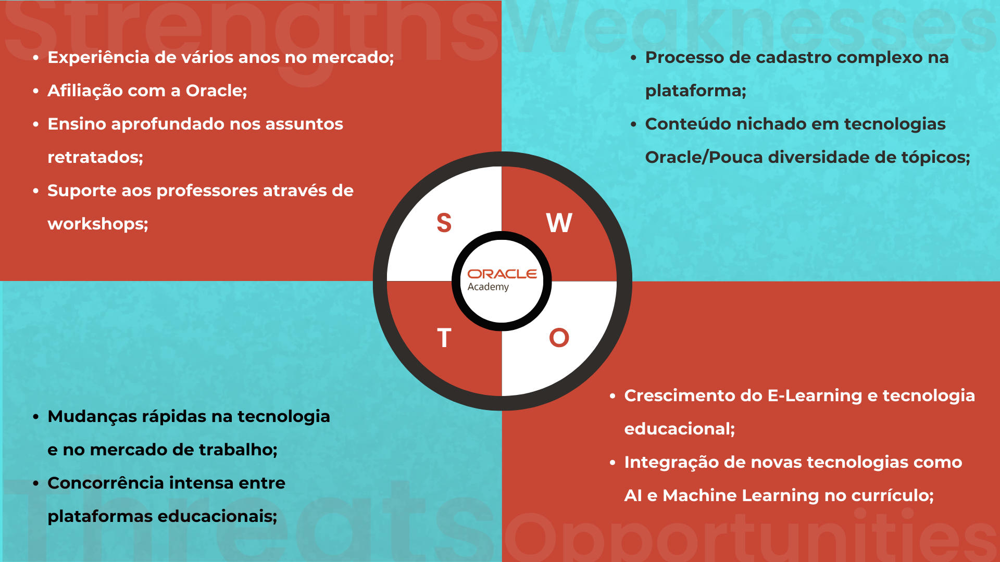<br>
<sub>Fonte: Material produzido pelos autores (2024)</sub>
</div>
<br>

### 1.1.3. Descrição da Solução Desenvolvida (sprints 1 e 4)

&nbsp;&nbsp;&nbsp;&nbsp;O problema principal que o nosso projeto visa resolver é o longo e complexo processo de onboarding de novos professores de tecnologia na plataforma. Entendemos que os professores possuem uma quantidade de tempo muito excassa, o que corrobora com a necessidade de manter o usuário engajado, por ter que passar parte de seu dia aprendendo. <br>&nbsp;&nbsp;&nbsp;&nbsp;A nossa solução resolve o processo de difícil entendimento de onboarding dos professores na plataforma Oracle Academy, através de um jogo que será disponibilizado de forma web. Na nossa visão, o professor gasta muita energia tentando ter acesso à plataforma, portanto, ajudaremos o usuário a navegar na plataforma Oracle Academy. <br>&nbsp;&nbsp;&nbsp;&nbsp;Esse jogo será feito utilizando o framework Phaser, e a linguagem de programação Javascript. Serão utilizadas estratégias de gamificação para tornar o aprendizado sobre as funcionalidades, navegação e criação de contas na plataforma mais interativa e engajante, mas não infantilizada.

### 1.1.4. Proposta de Valor (sprints 1 e 4)

&nbsp;&nbsp;&nbsp;&nbsp;Nós entendemos que o jogo tem muito a agregar tanto no âmbito acadêmico quanto no profissional dos professores. O maior problema não é somente a falta de vontade, mas a falta de alternativas práticas, rápidas, e interativas de se acessar esse conteúdo para assim serem ajudados a ensinarem os seus alunos. <br> &nbsp;&nbsp;&nbsp;&nbsp;Queremos trazer a melhor experiência possível para os usuários, ao eliminarmos o aprendizado alternativo, sendo necessário buscar vários tutoriais. Com o nosso jogo isso não acontecerá. Traremos praticidade. <br> &nbsp;&nbsp;&nbsp;&nbsp;
Em suma, o valor do nosso produto é facilitar e aprimorar o acesso a plataforma Oracle Academy.
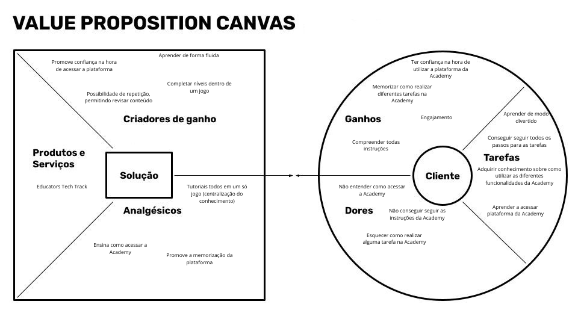

### 1.1.5. Matriz de Riscos (sprints 1 e 4)

| Ameaças                                                                    | Probabilidade | Impacto      | Plano de Ação                                                                                                                                                                                            |
| -------------------------------------------------------------------------- | ------------- | ------------ | -------------------------------------------------------------------------------------------------------------------------------------------------------------------------------------------------------- |
| Inexperiência Técnica em Programação Dificultar a Implementação das Ideias | Alta          | Catastrófico | Realizar sessões de feedback frequentes para refinar o jogo com base nas sugestões dos professores                                                                                                       |
| Não Cumprir os Requisitos Mínimos e Deadline                               | Média         | Catastrófico | Priorizar as funcionalidades essenciais para garantir a entrega do MVP dentro do prazo                                                                                                                   |
| Parceiro Desistir do Projeto                                               | Baixa         | Catastrófico | Marcar uma reunião com os responsáveis da Oracle Academy para entender os motivos da desistência e desmistificar prováveis medos que possam existir, e nos colocar à disposição para ajustes necessários |
| Perda dos Arquivos do Jogo                                                 | Alta          | Moderado     | Realizar vários backups em diferentes lugares e fazer upload dos arquivos dentro do GitHub                                                                                                               |
| Integrantes não Realizarem suas Tarefas Designadas dentro do Prazo         | Média         | Moderado     | Conversar de maneira franca e respeitosa com essa pessoa, e entender os motivos por trás desse impedimento                                                                                               |
| Jogo não ser Engajante o Suficiente                                        | Baixa         | Moderado     | Utilizar estratégias de gamificação que visem o público alvo, e realizar testes com professores para descobrir quais áreas devem ser melhoradas                                                          |
| Falhas Técnicas e Bugs                                                     | Alta          | Baixo        | Estabelecer um processo rigoroso de teste beta, envolvendo usuários finais (professores) para identificação precoce de problemas                                                                         |
| Problemas de Comunicação e Coordenação no Grupo                            | Média         | Baixo        | Implementar ferramentas de gestão de projetos e comunicação para melhorar a coordenação e o acompanhamento de tarefas                                                                                    |
| Desafios de Criatividade e Inovação para o Jogo                            | Baixa         | Baixo        | Promover brainstormings com feedback externo para inspirar soluções criativas e inovadoras                                                                                                               |


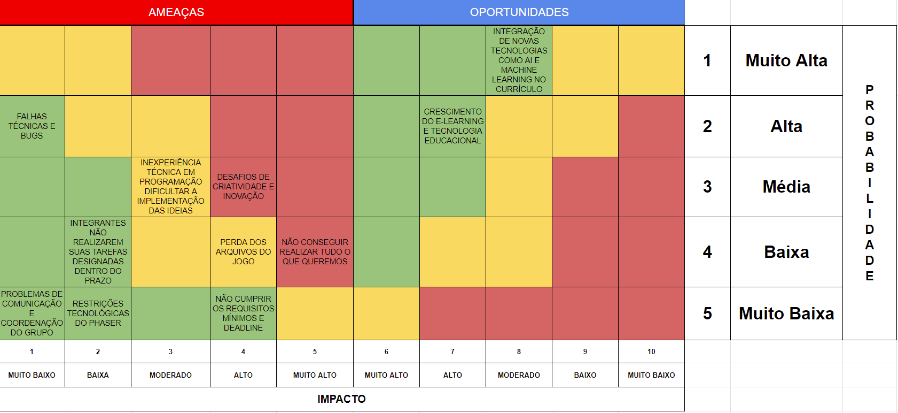
=======
<div align="center">
<sub>Figura 2 - Representação gráfica da matriz de riscos</sub><br>
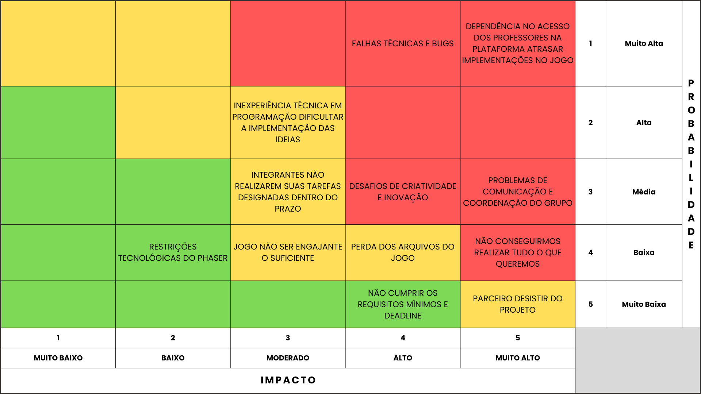<br>
<sub>Fonte: Material produzido pelos autores (2024)</sub>
</div>
<br>

### 1.1.6. Análise das 5 forças de Porter (sprint 4)

-**Rivalidade entre concorrentes**: A rivalidade entre concorrentes é evidente, com a Oracle Academy enfrentando a concorrência de outras instituições de educação em tecnologia, como a Microsoft Imagine Academy, Cisco Networking Academy e Google for Education. A competição é moderada, dada a diversidade de opções disponíveis para estudantes e instituições educacionais. Entretanto, a Oracle Academy destaca-se por oferecer treinamentos especializados nas tecnologias Oracle, o que pode ser particularmente atraente para certos clientes.

-**Ameaça de novos entrantes**: A ameaça de novos entrantes no mercado de educação tecnológica é moderada. Apesar da facilidade relativa de ingresso no mercado, conquistar uma base de clientes leais e estabelecer credibilidade é um desafio. A Oracle Academy, já estabelecida no mercado e com uma ampla rede de parceiros educacionais, criando uma barreira para novos concorrentes.

-**Poder de barganha dos clientes**: O poder de barganha dos compradores, representado por instituições de ensino e estudantes, é reduzido. Eles possuem certa influência na seleção dos programas de treinamento tecnológico que melhor atendem às suas necessidades. No entanto, a Oracle Academy pode manter sua competitividade oferecendo recursos exclusivos, acesso a tecnologias Oracle e parcerias com instituições renomadas, o que reduz o poder de barganha dos compradores.

-**Poder de barganha dos fornecedores**:O poder de barganha dos fornecedores é menor pelo fato de a Oracle Academy ser parte da Oracle Corporation, o que lhe permite ter acesso preferencial a recursos e tecnologias a preços competitivos.

-**Ameaça de produtos substitutos**: A ameaça de produtos ou serviços substitutos é crescente. Embora existam alternativas como cursos online gratuitos e plataformas de e-learning, a Oracle Academy oferece um programa mais estruturado e focado nas tecnologias Oracle. Entretanto, a popularidade crescente dessas plataformas gratuitas pode representar uma ameaça se os clientes as considerarem substitutos para programas formais como os oferecidos pela Oracle Academy.

<div align="center">
<sub>Figura 3 - Representação gráfica da análise das 5 forças de Porter</sub><br>
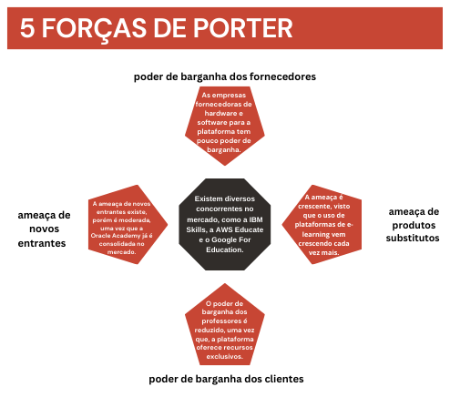<br>
<sub>Fonte: Material produzido pelos autores (2024)</sub>
</div>
<br>

## 1.2. Requisitos do Projeto (sprints 1 e 2)

| \#  | Requisitos                                                        |
| --- | ----------------------------------------------------------------- |
| 1   | Fazer um serious game                                             |
| 2   | Contemplar o mapeamento da jornada do professor na Oracle Academy |
| 3   | Ser em primeira pessoa                                            |
| 4   | Acesso do jogo via Web/PC                                         |
| 5   | Publicação do jogo em Git Pages                                   |
| 6   | Seguir as Brand Guidelines da Oracle                              |
| 7   | Fazer um Game Design Document                                     |

## 1.3. Lista de Tarefas

- Implementar os assets da fase 4
- Implementar o botão para mutar a trilha sonora do jogo
- Corrigir o debug da fase 3
- Implementar os aprendizados da aula de ux em nossa trilha sonora
- Fazer os assets da fase 5
- Implementar os assets da fase 5
- Testar o jogo completo
- Validar o produto com o cliente

## 1.4. Público-alvo do Projeto (sprint 2)

&nbsp;&nbsp;&nbsp;&nbsp;O público-alvo do nosso jogo são professores de conteúdos associados à tecnologia no Brasil, que buscam e/ou necessitam aprender a utilizar o ambiente da Oracle Academy, e ensinar para seus alunos os conteúdos presentes nesse sistema. Ademais, é importante ressaltar que esses professores podem estar agindo de forma independente de sua escola, já que não é necessário a integração de todos os docentes da escola utilizarem a plataforma, ou até mesmo a escola. <br> &nbsp;&nbsp;&nbsp;&nbsp;Entendemos também que os educadores que gostam de resolver quebra cabeças, fazer dinâmicas e que procuram diferentes formas de aprendizado, como o proposto pelo nosso jogo.

# <a name="c2"></a>2. Visão Geral do Jogo (sprint 2)

## 2.1. Objetivos do Jogo (sprint 2)

&nbsp;&nbsp;&nbsp;&nbsp;O objetivo é que os usuários ao final do jogo tenham completa competência e maestria em como a plataforma Oracle Academy funciona, desde o sistema de login, até navegar pelos diferentes cursos e adicionar os seus alunos. O jogador deve resolver uma série de diferentes desafios para que os professores se sintam engajados ao jogar e que tenham confiança ao aplicar os aprendizados no mundo real. Também consideramos importante reforçar o aprendizado durante o tempo de jogo, já que é de grande importante que o usuário aprenda sobre a plataforma Oracle Academy.

## 2.2. Características do Jogo (sprint 2)

### 2.2.1. Gênero do Jogo (sprint 2)

&nbsp;&nbsp;&nbsp;&nbsp;De acordo com o dicionário de Cambridge, a palavra _puzzle_ é: "um problema ou pergunta que você precisa resolver usando sua habilidade ou conhecimento". Dessa forma, alinhamos os objetivos, os requisitos, e decidimos que a melhor estratégia para entregar o MVP foi criar o jogo nessa temática. Também decidimos adicionar dois outros gêneros, simulação, e um dos requisitos, serious game.<br>
&nbsp;&nbsp;&nbsp;&nbsp;Um dos benefícios do gênero de simulação é trazer imersão para o mundo e história do jogo, além de permitir que os usuários possam colocar seus conhecimentos e habilidade do jogo em teste. Por fim, o gênero serious game está ligado ao teor educacional que queremos trazer.

### 2.2.2. Plataforma do Jogo (sprint 2)

&nbsp;&nbsp;&nbsp;&nbsp;O jogo está sendo desenvolvido para a plataforma desktop para permitir uma padronização maior do dispositivos no qual ele será rodado. Foi orientado que fosse utilizada o framework Phaser, dessa forma, o desenvolvimento web também facilitará o acesso para o público alvo.

### 2.2.3. Número de jogadores (sprint 2)

&nbsp;&nbsp;&nbsp;&nbsp;Para seguir a recomendação de jogo da parceira, um jogo de puzzle de um jogador teria as seguintes vantagens:

<ul>
<li>Permite ao jogador focar na resolução dos desafios lógicos, sem distrações ou interferências de outros jogadores;</li>
<li>Oferece ao jogador um ritmo próprio de aprendizado e progressão, sem pressão ou competição;</li>
<li>Estimula o pensamento criativo e a experimentação do jogador, sem limitações ou restrições impostas por outros jogadores;</li>
<li>Cria uma experiência mais imersiva e envolvente para o jogador, que se sente mais conectado com o mundo e a história do jogo.</li>
</ul>

&nbsp;&nbsp;&nbsp;&nbsp;Ou seja, um jogo singleplayer é a melhor opção que encontramos para o projeto.

### 2.2.4. Títulos semelhantes e inspirações (sprint 2)

&nbsp;&nbsp;&nbsp;&nbsp;Para criar qualquer tipo de ideia, é impossível não associarmos com algum outro conceito que nos inspirou, pode ser de forma direta, como por exemplo algum projeto com temáticas parecidas que decidimos usar como fonte para posteriormente torná-lo nosso, ou indireta, como lógicas de programação que têm certa similaridade, porém, não de forma intencional. Para o nosso jogo, pesquisamos vários jogos que tivessem entre 3 atributos (estética, mecânicas, gênero) essenciais que tivesse destaque para usarmos como inspiração para o nosso, entretanto, não era necessário conter todos esses atributos, apenas um. Esses foram os jogos de maior relevância:

<ul> <li>Carcará: Asas da Justiça, um serious game desenvolvido pela SuperNova Games que oferece uma experiência imersiva e envolvente, o jogo estimula o pensamento crítico, promove a compreensão do sistema judicial e educa os jogadores sobre questões éticas e legais relevantes à sociedade contemporânea.</li>
<li>A Little to the Left, um jogo de quebra-cabeça que desafia os jogadores a classificar, empilhar e organizar objetos em cenários variados, estimulando a formulação de estratégias variadas para resolver os mais de 100 desafioas que o jogo oferece, tudo isso com uma jogabilidade intuitiva e estética "fofa" e envolvente.</li>
<li>Unpacking, um jogo relaxante que consiste em desembalar e organizar objetos em um novo lar, a mecânica envolve uma combinação entre quebra-cabeças e decorações de interiores, incentivando o player a ter um senso de organização.</li>
<li>Aperture Desk Job, um jogo ambientado no famoso universo de "Portal" que consiste em gerenciar uma fábrica caótica através de puzzles em sua mesa de trabalho.</li>
<li>Chants of Sennar é um jogo ambientado em um deserto antigo, onde o personagem principal é um estrangeiro de uma terra distante que acorda em uma cidade totalmente diferente daquela que conhecia, possuindo apenas um caderno de notas com o objetivo de decifrar e entender a língua dessa civilização. Trata-se de um jogo repleto de quebra-cabeças que incentivam o jogador a usar ao máximo suas capacidades lógicas enquanto descobre mais sobre a sociedade.</li></ul>

### 2.2.5. Tempo estimado de jogo (sprint 5)

_Ex. O jogo pode ser concluído em 3 horas passando por todas as fases._

_Ex. cada partida dura até 15 minutos_

# <a name="c3"></a>3. Game Design (sprints 2 e 3)

## 3.1. Enredo do Jogo (sprints 2 e 3)

&nbsp;&nbsp;&nbsp;&nbsp;A história do jogo inicia em uma sala de aula, onde o professor ensina sua classe, e na lousa atrás dele existe uma desenho de um mapa do mundo. O professor começa a comentar sobre a plataforma que está usando, da sua experiência, de como os alunos irão acessar, e decidiu fazer uma analogia com o mapa. Entramos assim, no mundo da imaginação desses alunos, convertendo a interpretação deles em diferentes fases, desafios, toda a aventura do professor pelo mundo, adicionando vários elementos da conversa como objetos dentro das fases, mapas e easter eggs.

## 3.2. Personagens e/ou Elementos Interativos (sprints 2 e 3)

### 3.2.1. Controláveis

### Barco

&nbsp;&nbsp;&nbsp;&nbsp;Na fase 4, a temática principal é de navegação. O jogador deve guiar um barco no arquipélago indonésio para chegar no objetivo. Assim, o usuário liberdade na forma como explora, fazendo um contraste com a linearidade.<br>
&nbsp;&nbsp;&nbsp;&nbsp;Além desse controlável, não há nenhum outro personagem representado que seja utilizado pelo professor.

### 3.2.2. Non-Playable Characters (NPC)

&nbsp;&nbsp;&nbsp;&nbsp;Na fase 5, o jogador irá interagir com professores dos lugares pelos quais passou, simulando uma ajuda do suporte real que os profissionais da Oracle Academy realizam. Os NPCs representarão os países da Polônia, Indonésia, Egito, EUA e Brasil, tendo objetivo de representar diversas etnias e culturas. Estamos definindo as pessoas que o usuário ajudará, mas temos o consciência de que é absolutamente imprescindível que deve conter diversidade.

### 3.2.3. Diversidade e Representatividade


&nbsp;&nbsp;&nbsp;&nbsp;O Educators Tech Track foi criado com o intuito de oferecer ao usuário uma experiência de jogo envolvente com um ambiente visual e auditivo que respeite a diversidade e as necessidades dos docentes que irão se envolver no processo de jogatina. Para alcançarmos esse objetivo, cada aspecto do jogo foi cuidadosamente considerado.

&nbsp;&nbsp;&nbsp;&nbsp;Ao iniciar o jogo, os jogadores visualizam uma tela de créditos que apresenta a equipe de desenvolvimento e fornece uma introdução detalhada sobre a origem do jogo e sua proposta. Essa abordagem visa estabelecer uma conexão inicial com o público-alvo, criando um maior esclarecimento e oferecendo transparência e engajamento desde o início.

&nbsp;&nbsp;&nbsp;&nbsp;O menu de fases é projetado para ser uma interface funcional. Ao apresentar um mapa mundial, os jogadores são convidados a explorar uma variedade de contextos culturais, ampliando assim sua compreensão e apreciação da diversidade global, focando nos países: Estados Unidos, Egito, Polônia, Indonésia e Brasil. 

&nbsp;&nbsp;&nbsp;&nbsp;Cada fase é cuidadosamente estruturada para fornecer orientação clara e concisa aos jogadores. Uma tela de instruções inicial, com texto de fácil leitura sobre fundo preto, garante que os objetivos e as mecânicas de cada desafio sejam compreendidos de forma eficaz. Essa abordagem busca garantir a acessibilidade do jogo.

&nbsp;&nbsp;&nbsp;&nbsp;Além disso, a inclusão de efeitos sonoros específicos para cada ação e interação no jogo enriquece a experiência auditiva e oferece uma camada adicional de compreensão e imersão.

## 3.3. Mundo do jogo (sprints 2 e 3)

### 3.3.1. Locações Principais e/ou Mapas (sprints 2 e 3)

&nbsp;&nbsp;&nbsp;&nbsp;O jogo começa em uma sala de aula, e posteriormente é levado para dentro do quadro da sala de aula, onde poderá explorar países como Estados Unidos, Egito, Polônia, Indonésia e o Brasil. A seleção de fases será um mapa antigo com todos os locais descritos destacados, e cada fase será tematizada com aspectos de sua respectiva região, contendo também elementos do universo que o jogo cria. Estamos desenvolvendos o level design e os puzzles das fases, e decidimos a temática de cada fase.

**1. Estados Unidos da América - California:** Ordenar imagens/polaroids na ordem dos passos para o cadastro na plataforma para desvendar um mistério. Essa fase contará com um sistema de magnetismo nas fotos com seus respectivos lugares;

**2. Egito - Cairo:** Escavar/desvendar as funções disponíveis para o professor em uma escavação arqueológica no Egito. Existirá como desafio adicional a tradução de uma linguagem desconhecida que precisa ser desvendada para descobrir todas as funções e como o professor pode usá-las;

**3. Polônia - Varsóvia:** Conectar cabos/energia em um servidor da Polônia, criando canais de servidores para sair daquela fase. Ainda estamos desenvolvendo quais mecânicas serão utilizadas;

**4. Arquipélago indonésio/Ilha de Java - Indonésia:** Navegação pelo mar e pelas ilhas a fim de ensinar sobre como o professor faz o caminho para a integração com a Nuvem. Ainda estamos desenvolvendo quais mecânicas serão utilizadas;

**5. São Paulo - Brasil:** Suporte para outros professores pelo mundo, reforçando o aprendizado da jornada e ensinando sobre o suporte para os professores. O jogador deve ajudar 5 diferentes professores que são dos mesmos lugares que visitou pelo mundo, sendo necessário fazer as escolhas corretas sobre tudo que aprendeu.

<div align="center">
<sub>Figura 4 - Tela do menu de fases</sub>
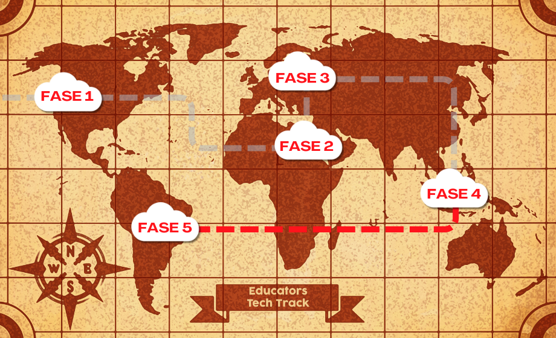
<sup>Fonte: Material produzido pelos autores (2024)</sup>
</div>

### 3.3.2. Navegação pelo mundo (sprints 2 e 3)

&nbsp;&nbsp;&nbsp;&nbsp;A navegação acontecerá através de um mapa do mundo. Existem pins nos locais em que o jogador pode visitar conforme for desbloqueando as fases anteriores. Para entrar nas fases o usuário usará o mouse, e quando clicar, a cena irá mudar para a fase que foi selecionada. Como existe uma progressão para o aprendizado do professor, é mais coerente que as fases também sigam essa vertente.

### 3.3.4. Concept Art (sprint 2)

&nbsp;&nbsp;&nbsp;&nbsp;Aqui está incluído as Concepts Arts das fases, desde a sua primeira idealização, até modelos visuais mais semelhantes com a estética do jogo.

<div align="center">
<sub>Figura 5 - Concept Art do mapa de fases em papel</sub>
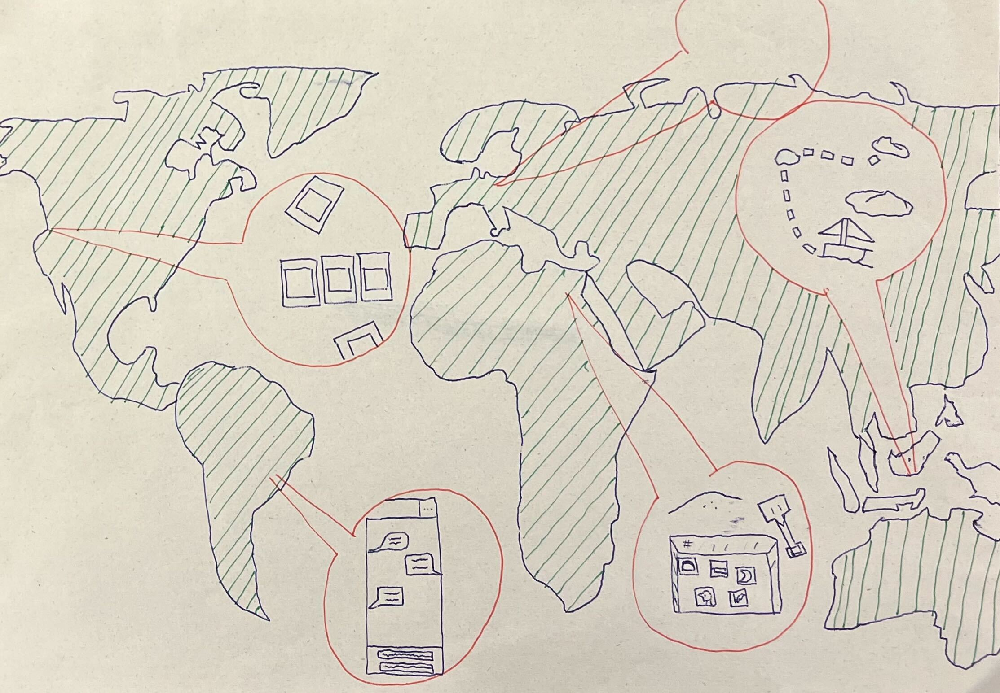
<sup>Fonte: Material produzido pelos autores (2024)</sup>
</div>
<br>

<div align="center">
<sub>Figura 6 - Concept Art do mapa feita com colagem digital</sub>
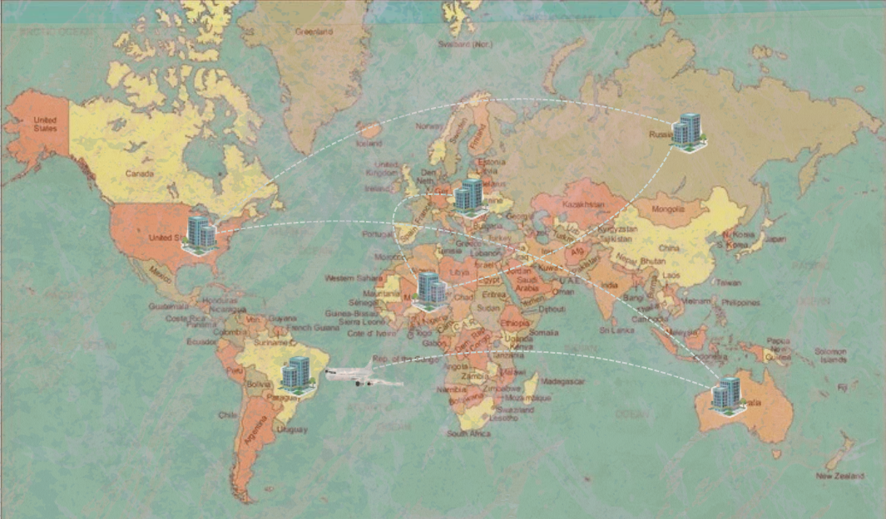
<sup>Fonte: Material produzido pelos autores (2024)</sup>
</div>
<br>

<div align="center">
<sub>Figura 7 - Concept Art do mapa e das fases nos seus respectivos países</sub>
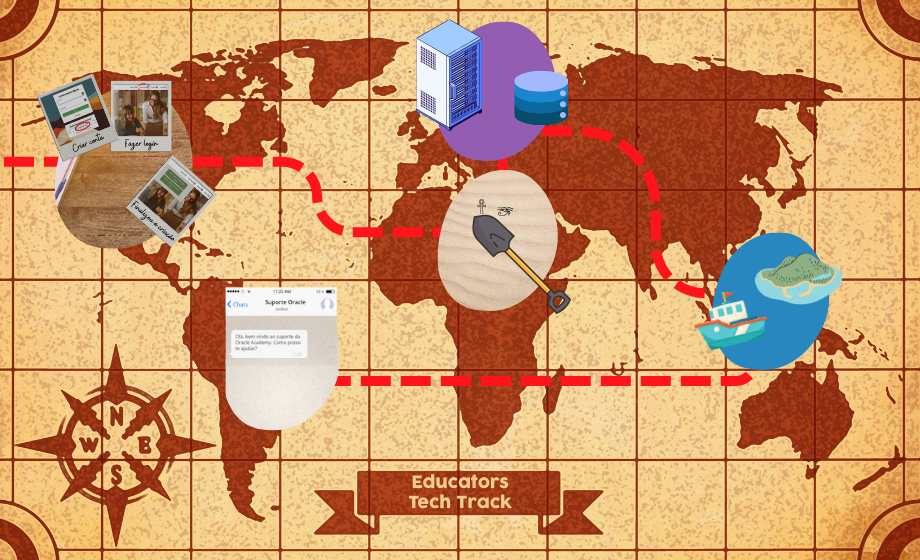
<sup>Fonte: Material produzido pelos autores (2024)</sup>
</div>

### 3.3.5. trilha sonora (sprint 3)

\# | titulo | ocorrência | autoria
--- | --- | --- | ---
1 | tema do jogo geral | jogo todo | [MixKit Music Tracks](https://mixkit.co/)

## 3.4. Inventário e Bestiário (sprint 3)

### 3.4.1. Inventário

&nbsp;&nbsp;&nbsp;&nbsp;Uma lista com todos os itens que o professor poderá interagir durante a experiência.


\# | Item/Conjunto de itens | | como obter | função | efeito sonoro
--- | --- | --- | --- | --- | ---
1 | Bag | (imagem da bolsa no egito) | é obtida automaticamente ao entrar na fase 2 | Armazenar as informações que obter na fase 2 | som de guardar itens
2 | Polaroids (16) |  | Aparece automaticamente na mesa do professor na fase 1 | Ilustrar informações de como fazer um cadastro de professor na plataforma | (A definir)
3 | Lixos do deserto (Latinhas, Besouro, Caranguejo,) | 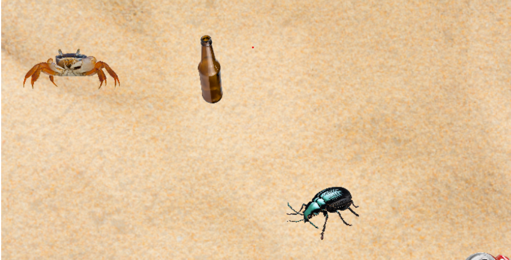 | Estão escondidos na areia na fase 2 | Fazer o jogador tomar decisões | (A definir)
4 | Pergaminhos (9) | 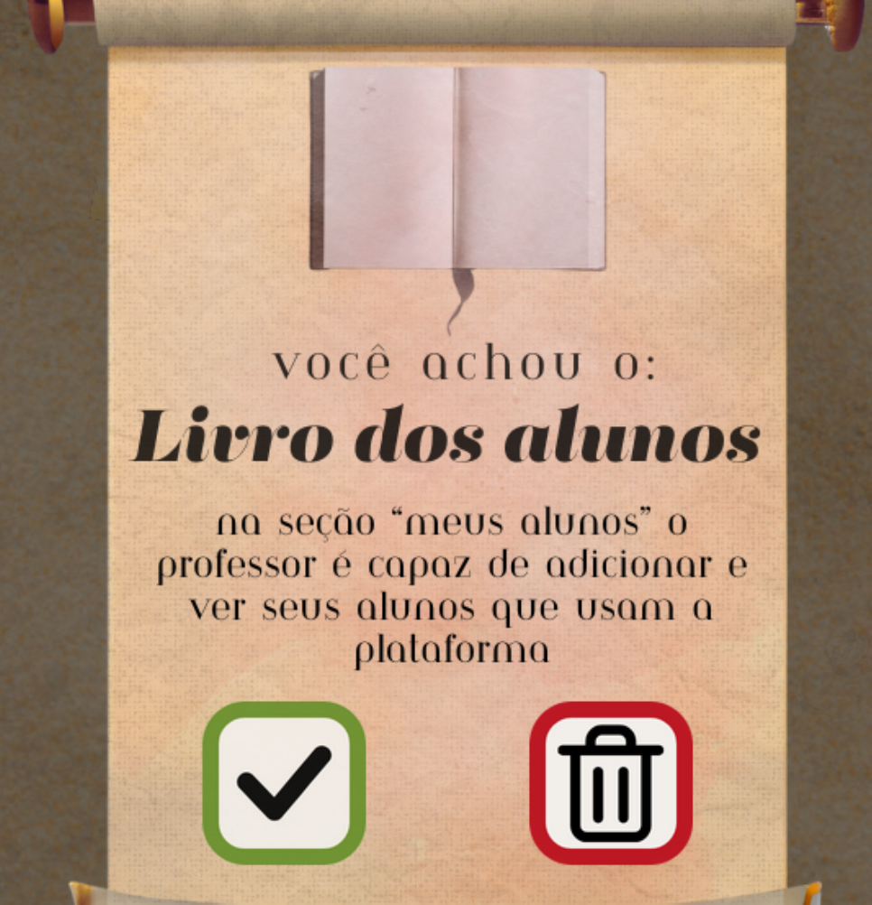 | Escavando na fase 2 | Mostrar ao Jogador quais são os recursos da Academy | (A definir) 

## 3.5. Gameflow (Diagrama de cenas) (sprint 2)

&nbsp;&nbsp;&nbsp;&nbsp;A seguir, encontra-se o fluxograma das cenas do jogo em imagem, com a sequência e especificações da progessão dos níveis, quanto a programação das classes. Para a visualização do projeto no figma na íntegra, basta acessar o seguinte [link](https://www.figma.com/community/file/1345569928909319118/game-flow-educators-tech-track).<br>
&nbsp;&nbsp;&nbsp;&nbsp;A primeira cena é a animação para mostrar o nome inicial do jogo, contendo também um botão que inicia essa cutscene. Após a animação, o jogador será introduzido para a tela inicial do jogo, onde haverá informações sobre o projeto, crédito aos integrantes e professores, e o botão de começar o jogo, sendo esse o único interagível que levará para a próxima cena. Com o botão apertado, o usuário é levado para a tela de menu de fases, onde estará liberada apenas a fase 1, e conforme o jogador conclua mais fases, mais serão liberadas, sendo todas elas botões que levam para a cena de sua respectiva fase.<br>
&nbsp;&nbsp;&nbsp;&nbsp;Na primeira fase, existem as polaroids que possuem o tipo de ação "drag & drop", em que as imagens podem ser movidas pela tela, colocadas no espaço correto. Caso o espaço que o player tenha colocado seja o errado, a foto não irá se conectar, rejeitando-a. Porém, caso seja correta, irá ficar presa naquele espaço destinado à aquela polaroid.

<div align="center">
<sub>Figura 8 - Fluxograma de cenas e do storyboard de programação</sub><br>
<br>
<sub>Fonte: Material produzido pelos autores (2024)</sub>
</div><br>

<div align="center">
<sub>Figura 9 - Print tirado da classe StartGame</sub>
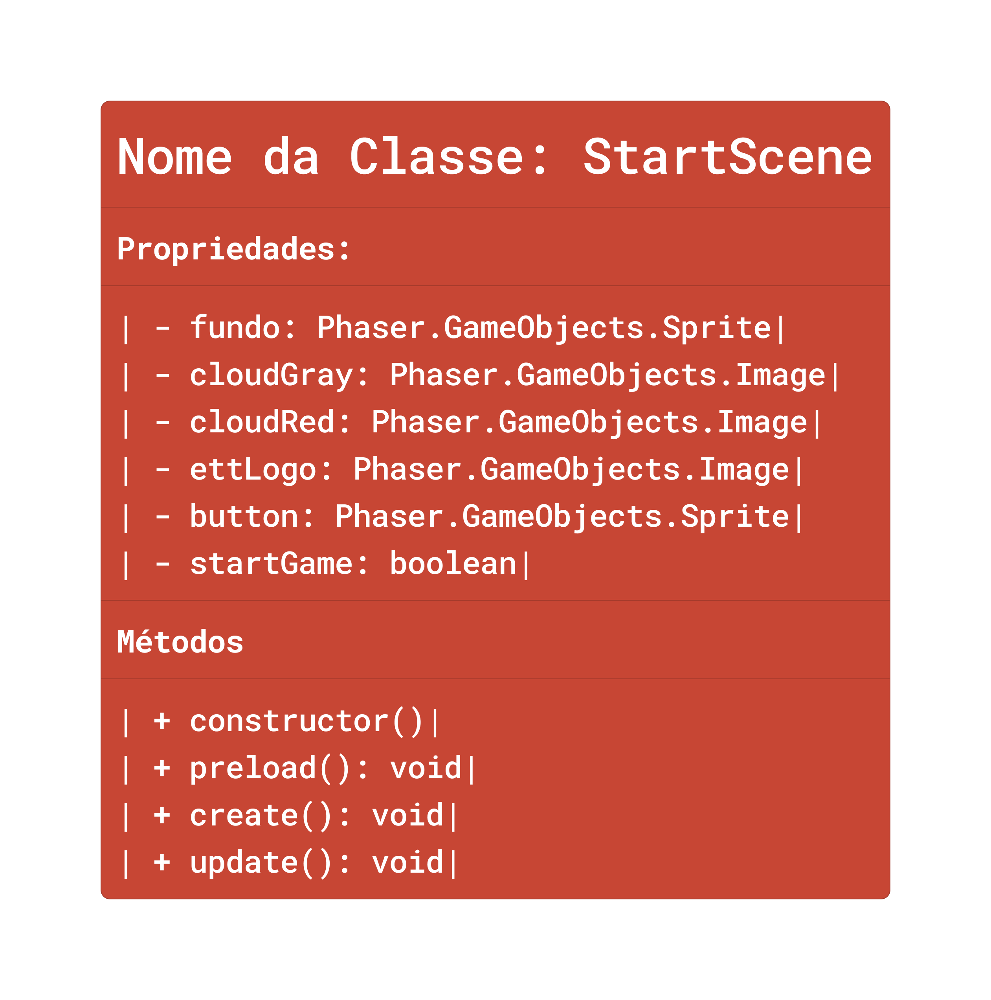<br>
<sub>Fonte: Material produzido pelos autores (2024)</sub>
</div><br>
<div align="center">
<sub>Figura 10 - Print tirado da classe CreditosScene</sub>
<br>
<sub>Fonte: Material produzido pelos autores (2024)</sub>
</div><br>
<div align="center">
<sub>Figura 11 - Print tirado da classe FirstTableScene</sub>
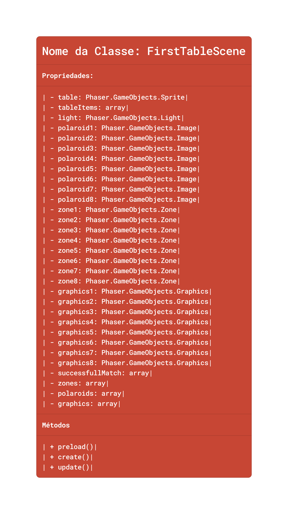<br>
<sub>Fonte: Material produzido pelos autores (2024)</sub>
</div><br>

## 3.6. Regras do jogo (sprint 3)

&nbsp;&nbsp;&nbsp;&nbsp;O jogador deve seguir o caminho do menu de fases resolvendo cada puzzle, adquirindo o conhecimento sobre como utilizar a plataforma da Oracle Academy.

- Fase 1: O jogador deve colocar as polaroids na ordem correta, com cada uma contendo uma informação de como fazer o cadastro de professor na plataforna na ordem correta. Após isso poderá seguir para a próxima fase.

* Fase 2: O jogador deve escavar e procurar itens perdidos dentro da areia e ao analisa-los julgar se a informação obtida é útil ou não, descartando ou guardando na bag.

- Fase 3:

- Fase 4:

- Fase 5:

## 3.7. Mecânicas do jogo (sprint 3)

&nbsp;&nbsp;&nbsp;&nbsp;Utilizamos o Framework MDA para organizar as mecânicas do nosso projeto e deixar mais organizado.

\# | Fase | Mechanics | Dynamics | Aesthetics
--- | --- | --- | --- | ---
1 | Polaroids | Os Polaroids, representando fragmentos de uma narrativa, podem ser movidos e reorganizados para formar uma sequência lógica. | O jogador, ao segurar e arrastar os Polaroids, deve ordená-los corretamente para desbloquear o avanço na fase, estimulando a resolução de quebra-cabeças visuais | A organização dos Polaroids não apenas desbloqueia o progresso, mas também cria uma estética visual coesa, proporcionando uma sensação de completude
2 | Escavação | Os jogadores são desafiados a escavar áreas de areia em busca de objetos, decifrando mensagens e passos a seguir. | Ao escavar uma área específica cheia de areia, o jogador descobre itens aleatórios que fornecem pistas para a ordem correta, encorajando a exploração estratégica. | A descoberta dos hieróglifos e a decodificação da mensagem proporcionam uma estética de desvendar mistérios, reforçando a sensação de progresso e conquista.
3 | Canais | Fios desconectados precisam ser habilmente interligados para otimizar o funcionamento do sistema. | O jogador enfrenta o desafio de conectar todos os fios do sistema, promovendo uma abordagem estratégica para resolver problemas de organização. | A interconexão dos fios não só restaura a funcionalidade, mas também cria uma estética organizada, destacando a importância da ordem na solução de desafios.
4 | Ilha de Java | Um arquipélago vasto aguarda exploração, requerendo o uso do barco e controles de teclado (A, W, S, D) para navegar. | O jogador deve explorar o arquipélago, utilizando o barco e os controles direcionais, para coletar informações essenciais e avançar na fase. | A sensação de descoberta é aprimorada ao explorar diferentes ilhas, proporcionando uma estética visualmente rica e recompensadora.
5 | Chat de Suporte | Um chat interativo com múltiplas opções de resposta, simulando um ambiente de suporte. | O usuário é desafiado a escolher as respostas corretas em um chat interativo, fortalecendo a habilidade de tomar decisões e interagir com personagens virtuais. | A dinâmica de companheirismo é realçada pela interação no chat, contribuindo para uma estética de cooperação e colaboração no ambiente virtual.


# <a name="c4"></a>4. Desenvolvimento do Jogo

## 4.1. Desenvolvimento preliminar do jogo (sprint 1)

&nbsp;&nbsp;&nbsp;&nbsp;Desenvolemos a tela inicial do jogo e planejamos expandir para as próximas fases nos próximos sprints. Como nosso objetivo é equilibrar a seriedade educacional com a interatividade do jogo, é crucial que também seja uma experiência progressiva e acessível aos usuários. <br>
&nbsp;&nbsp;&nbsp;&nbsp;As fases do jogo representarão diferentes níveis de conhecimento e familiarização da plataforma, e ao final de cada uma dessas fases, haverá perguntas se o usuário entendeu ou gostaria de repetir mais lentamente, para realmente fixar aquele conteúdo.

<div align="center">
<sub>Figura 12 - Tela de repetição de fase</sub>
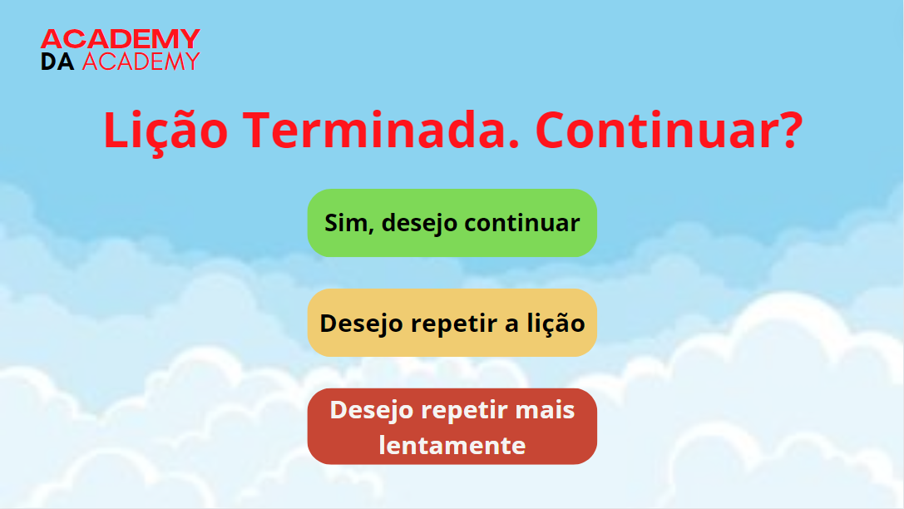<br>
<sub>Fonte: Material produzido pelos autores (2024)</sub>
</div><br>

&nbsp;&nbsp;&nbsp;&nbsp;Os professores também receberão um certificado ao final do jogo que reflete sua habilidade em se locomover na plataforma. As fases serão representadas visualmente através de uma jornada ascendente nas nuvens, a progressão seria da seguinte forma:

<div align="center">
<sub>Figura 13 - Menu de fases</sub>
<br>
<sub>Fonte: Material produzido pelos autores (2024)</sub>
</div><br>

&nbsp;&nbsp;&nbsp;&nbsp;A parte prática que fizemos foi criar uma tela inicial, um fundo com uma textura que se mexe, e um botão que ao clicado, abrem-se as nuvens para revelar o nome do jogo. Posteriormente, seria interessante adicionar algumas opções abaixo da logo, como por exemplo o botão de iniciar o jogo. Aqui está a tela inicial com o botão e o que acontece quando pressionado:

<div align="center">
<sub>Figura 14 - Botão de início</sub>
<br>
<sub>Fonte: Material produzido pelos autores (2024)</sub>
</div><br>

<div align="center">
<sub>Figura 15 - Nuvens abrindo</sub>
<br>
<sub>Fonte: Material produzido pelos autores (2024)</sub>
</div><br>

<div align="center">
<sub>Figura 16 - Nuvens completamente abertas</sub>
<br>
<sub>Fonte: Material produzido pelos autores (2024)</sub>
</div><br>

&nbsp;&nbsp;&nbsp;&nbsp;Entendemos que houveram certas dificuldades no meio da produção desse sprint. A falta de conhecimento técnico do framework e da linguagem de programação, um feriado que tirou 3 dias de aula, mudanças de organização do grupo e de descobertas de requesitos, tudo isso influenciou na entrega de um produto que por mais que seja funcional, ainda tem muito potencial que por conta desses impecílios, não demos conta de implementar. Mas será a prioridade do grupo que no próximo sprint busquemos todas essas oportunidades e ideias adicionando ainda mais outras.

## 4.2. Desenvolvimento básico do jogo (sprint 2)

&nbsp;&nbsp;&nbsp;&nbsp;Com base nos feedbacks na apresentação dos conceitos da primeira sprint, decidimos então desenvolver a primeira fase do jogo, que consiste em organizar polaroids em uma mesa na ordem certa de modo a fazer alusão ao processo de realizar login na Oracle Academy. As fotos são arrastáveis com o mouse, permitindo o movimento pelo jogador ao longo da tela. Ao completar um set de 3 polaroids em ordem correta, estas são retiradas e novos espaços são abertos para inserir a próxima sequência. A principal missão dessa fase é o aprendizado e reforço das informações que são descobertas, associando posteriormente, a experiência de realizar o login na própria plataforma.

<div align="center">
<sub>Figura 17 - Print tirado da primeira fase do jogo</sub><br>
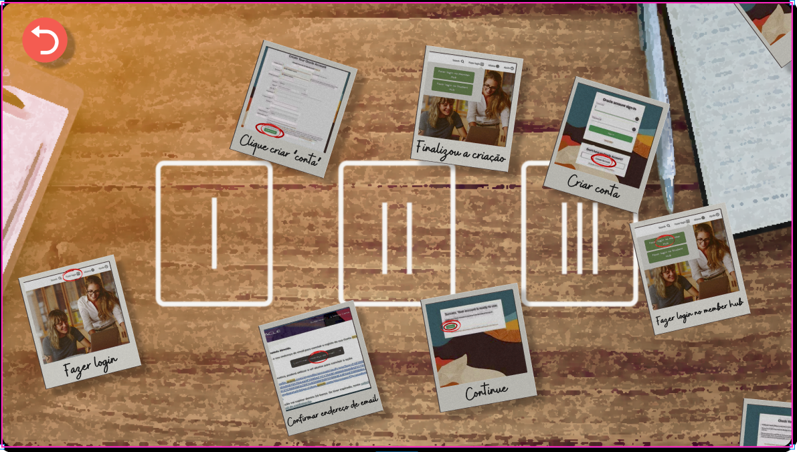<br>
<sub>Fonte: Material produzido pelos autores (2024)</sub>
</div><br>

&nbsp;&nbsp;&nbsp;&nbsp;Também criamos a aba de créditos dentro da tela inicial do jogo, que inclui os autores do jogo, ao passar o mouse em cima dos alunos da esquerda; os orientadores e professores do projeto, nos alunos da direita; e os objetivos e público alvo do jogo ao colocar o mouse sobre a professora.

<div align="center">
<sub>Figura 18 -Tela de Créditos</sub><br>
<br>
<sub>Fonte: Material produzido pelos autores (2024)</sub>
</div><br>

&nbsp;&nbsp;&nbsp;&nbsp;Uma das principais mudanças da primeira sprint para esta foi a mudança estética do jogo, alterando a ideia de um céu nublado por um mapa mundi. Seguindo esta mudança, a cor de fundo da tela inicial foi alterada para condizer com a mudança visual.

<div align="center">
<sub>Figura 19 - Menu de fases</sub><br>
<br>
<sub>Fonte: Material produzido pelos autores (2024)</sub>
</div>
<br>
<div align="center">
<sub>Figura 20 - Nova tela inicial</sub><br>
<br>
<sub>Fonte: Material produzido pelos autores (2024)</sub>
</div>
<br>

&nbsp;&nbsp;&nbsp;&nbsp;Por fim, realizamos uma coleta de ideias por meio do Crazy 8 para auxiliar na definição das fases que terão que ser implementadas nos próximos sprints.

<div align="center">
<sub>Figura 21 - Concept Art dos Minijogos</sub><br>
<br>
<sub>Fonte: Material produzido pelos autores (2024)</sub>
</div>
<br>

&nbsp;&nbsp;&nbsp;&nbsp;A fase 2 será representativa de uma escavação arqueológica, em que o jogador irá desenterrar os recursos ao qual ele tem acesso na plataforma da Oracle Academy. A fase 3 será sobre conectar fios em um servidor. A fase 4 será sobre explorar os caminhos certos no arquipélago da Indonésia, para seguir as instruções de criação de conta Cloud. A última fase simulará o suporte ao professor que o jogador tem acesso, exemplificando casos em que possa precisar de ajuda.

## 4.3. Desenvolvimento intermediário do jogo (sprint 3)

&nbsp;&nbsp;&nbsp;&nbsp;Nessa sprint, adicionamos algumas melhorias à fase já existente da mesa com polaroids, possibilitando que, conforme feedback do parceiro, as polaroids pudessem ser ampliadas para que fossem melhores vistas. Também foi ampliado o número de cenas para contemplar um maior número de polaroids, já que estavam faltando alguns passos no tutorial.

&nbsp;&nbsp;&nbsp;&nbsp;Para a visualização das polaroids em tamanho ampliado, começamos chamando a função por nós definida como addBiggerPolaroids, passando como parâmetor a classe atual da cena, conforme o padrão das outras já feitas anteriormente.

```javascript
create() {
    this.camera.main.fadeIn(400, 0, 0, 0);
    //criação das DropZones
    addDropzone(this);
    //adicionando camadas da mesa
    addTable(this);
    //Adicionando polaroids maiores
    addBiggerPolaroid(this);
    //Adicionando Polaroids
    addPolaroid(this);
    //Adiciona aba escura com instruções
    addInstructions(this);
    //Adicionando Inputs
    addInput(this);
}
```

&nbsp;&nbsp;&nbsp;&nbsp;A função chamada está definida conforme abaixo, na mesma lógica de adição das polaroids normais, porém colocando numa camada ainda maior e movendo-as de acordo com os cliques do usuário, seja para mostrá-la ou tirá-la da tela.
```javascript
function addBiggerPolaroid(scene){
    for (let i = 0; i < polaroids.lenght; i++) {
        biggerPolaroids[i] = scene.add
        .sprite(2000, 2000, `gpolaroid${i + 1}`)
        .setScale(0.4)
        .setInteractive({ cursor: "pointer"})
        .setDepth(10)
        .setVisible(true)
        .on('pointerdown', function(){
            biggerPolaroids[i].x = 2000
            biggerPolaroids[i].y = 2000
        });
    }
}
```

&nbsp;&nbsp;&nbsp;&nbsp;Para completar a sequência de polaroids no número correto, foi chamada uma nova cena caso as oito polaroids iniciais fossem preenchidas. A nova cena é exatamente igual à imediatamente anterior, porém com outros assets sendo carregados para as novas polaroids.
<br>

```javascript
if(polaroidsFixed == 8){
    nextButton(scene);
}
```

&nbsp;&nbsp;&nbsp;&nbsp;Desenvolvemos o Menu de Fases, tornando-o funcional para acessar tanto a fase 1 quanto a fase 2, podendo transitar entre elas quando quiser.
<br>
<div align="center">
<sup>Figura 22 - Imagem do mapa</sup>
<br>
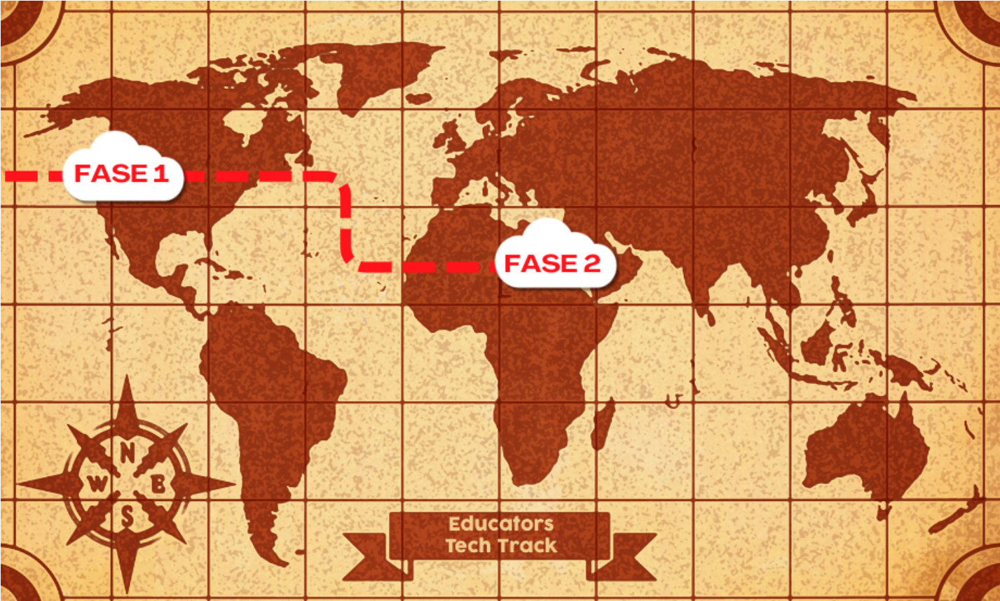
<sup>Fonte: Material produzido pelos autores (2024)</sup>
</div>
<br>
&nbsp;&nbsp;&nbsp;&nbsp;Desenvolvemos a fase 2 por completo, consistindo num puzzle de escavação e interpretação de informação, o jogador deve procurar os itens pela areia e analisar qual descoberta é útil ou não, tendo a opção de armazenar ou descartar.
<br>
<div align="center">
<sup> Figura 23 - Imagem da fase 2 </sup>
<br>
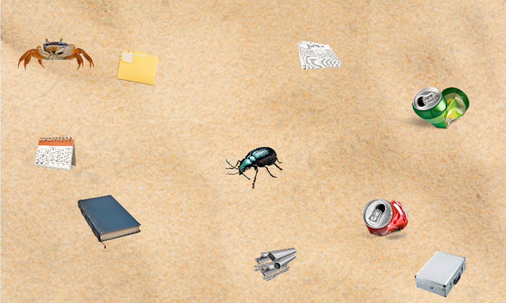
<sup>Fonte: Jogo autoral</sup>
<br>
<sup>Figura 24 - Imagem do pergaminho</sup>

<sup>Fonte: Jogo autoral</sup>

</div> 

## 4.4. Desenvolvimento final do MVP (sprint 4)

_Descreva e ilustre aqui o desenvolvimento da versão final do jogo, explicando brevemente o que foi entregue em termos de MVP. Utilize prints de tela para ilustrar. Indique as eventuais dificuldades e planos futuros._

## 4.5. Revisão do MVP (sprint 5)

_Descreva e ilustre aqui o desenvolvimento dos refinamentos e revisões da versão final do jogo, explicando brevemente o que foi entregue em termos de MVP. Utilize prints de tela para ilustrar._

# <a name="c5"></a>5. Testes (sprint 4)

## 5.1. Casos de Teste

&nbsp;&nbsp;&nbsp;&nbsp; Os casos de testes aqui descritos contemplam tudo o que pode e deve funcionar dentro de nosso jogo, desde o clique de botões, funcionalidades dos puzzles até transição de cenas.

| \#  | pré-condição | descrição do teste  | pós-condição |
| --- | --- | --- | --- |
1 | posicionar o jogo na tela de abertura | iniciar o jogo na tela de início | o usuário deve ver a tela de início|
2 | clicar no botão | as nuvens devem se arrastar lateralmente | o logo do jogo precisa aparecer |
3 | início da tela de créditos | todos os assets devem carregar em suas respectivas posições | a tela deve estar completa com a imagem da sala de aula |
4 | passar mouse em cima de uma imagem com bordas iluminadas | o crédito relacionado a essa respectiva imagem deve aparecer com um background escuro com baixa opacidade | o crédito deve sumir ao tirar o mouse da imagem e voltar para como estava antes |
5 | clicar em "começar jogo" na tela de créditos | transição para a cena do menu de fases | tela do menu de fases |
6 | Clicar nas nuvens do Menu de Fases | transição do Menu para cada Fase, independente de qual seja | O usuário deve acessar a fase selecionanda
7 | clicar nas polaroids (Fase 1) |  Receber informações mais detalhadas da polaroid | O usuário deve ver a informação ampliada e detalhada
8 | Arrastar as polaroids (Fase 1) | Arrastar cada polaroid | locomover as polaroids pela tela
9 | Colocar a polaroid nos espaços corretos | Fixar a polaroid na ordem correta de acordo com que está escrito | Fixar a polaroid
10 | Clicar no botão de avançar (Fase 1) | depois da primeira sessão de polaroids vem a seguinte, e para transitar de uma para outra, tem que apertar no botão | Transitar da primeira cena de polaroid para segunda

## 5.2. Testes de jogabilidade (playtests) (sprint 4)

### 5.2.1 Registros de testes

_Descreva nesta seção as sessões de teste/entrevista com diferentes jogadores. Registre cada teste conforme o template a seguir._

| Nome                                     | João Jonas (use nomes fictícios)                                                                                                         |
| ---------------------------------------- | ---------------------------------------------------------------------------------------------------------------------------------------- |
| Já possuía experiência prévia com games? | sim, é um jogador casual                                                                                                                 |
| Conseguiu iniciar o jogo?                | sim                                                                                                                                      |
| Entendeu as regras e mecânicas do jogo?  | entendeu as regras, mas sobre as mecânicas, apenas as essenciais, não explorou os comandos complexos                                     |
| Conseguiu progredir no jogo?             | sim, sem dificuldades                                                                                                                    |
| Apresentou dificuldades?                 | Não, conseguiu jogar com facilidade e afirmou ser fácil                                                                                  |
| Que nota deu ao jogo?                    | 9.0                                                                                                                                      |
| O que gostou no jogo?                    | Gostou de como o jogo vai ficando mais difícil ao longo do tempo sem deixar de ser divertido                                             |
| O que poderia melhorar no jogo?          | A responsividade do personagem aos controles, disse que havia um pouco de atraso desde o momento do comando até a resposta do personagem |

### 5.2.2 Melhorias

Durante os playtests realizados, provou-se que a mecânica da fase 3 não está intuitiva, o que fez com que alguns jogadores não conseguissem progredir na fase. Ademais, percebemos também com o teste do professor Cláudio que alguns detalhes precisam ser reparados, como um bug nas polaroids da fase 1 e um problema de dimensionamento da tela na fase 4.

# <a name="c6"></a>6. Conclusões e trabalhos futuros (sprint 5)

_Escreva de que formas a solução do jogo atingiu os objetivos descritos na seção 1 deste documento. Indique pontos fortes e pontos a melhorar de maneira geral._

_Relacione os pontos de melhorias evidenciados nos testes com plano de ações para serem implementadas no jogo. O grupo não precisa implementá-las, pode deixar registrado aqui o plano para futuros desenvolvimentos._

_Relacione também quaisquer ideias que o grupo tenha para melhorias futuras_

# <a name="c7"></a>7. Referências (sprint 5)

_Incluir as principais referências de seu projeto, para que seu parceiro possa consultar caso ele se interessar em aprofundar. Um exemplo de referência de livro e de site:_<br>

SOBRENOME, Nome. Título do livro: subtítulo do livro. Edição. Cidade de publicação: Nome da editora, Ano de publicação. <br>

GAMES, Supernova. Carcará: Asas da Justiça. Fortaleza: Supernova Games, 2014.<br>

RUNDISC. Chants of Sennaar. Paris: Focus Home Interactive, 2023.<br>

BEAM, Witch. Unpacking. Brisbane: Humble Games, 2021<br>

INFERNO, Max. A Little to the Left. Sheffield: Secret Mode, 2022. <br>

INFORSATO, E. C.; ROBSON, A. S. A preparação das aulas. In: UNIVERSIDADE ESTADUAL PAULISTA. Prograd. **Caderno de Formação:** formação de professores didática
geral. São Paulo: Cultura Acadêmica, 2011, p. 86-99, v. 9.<br>

CAMBRIDGE DICTIONARY. **puzzle**. Disponível em: <https://dictionary.cambridge.org/dictionary/english/puzzle>. Acesso em 27 fev. 2024<br>

INTELI. Adalove. Disponível em: https://adalove.inteli.edu.br/feed. Acesso em: 1 out. 2023 <br>
SOBRENOME, Nome. Título do site. Disponível em: link do site. Acesso em: Dia Mês Ano

# <a name="c8"></a>Anexos

_Inclua aqui quaisquer complementos para seu projeto, como diagramas, imagens, tabelas etc. Organize em sub-tópicos utilizando headings menores (use ## ou ### para isso)_
